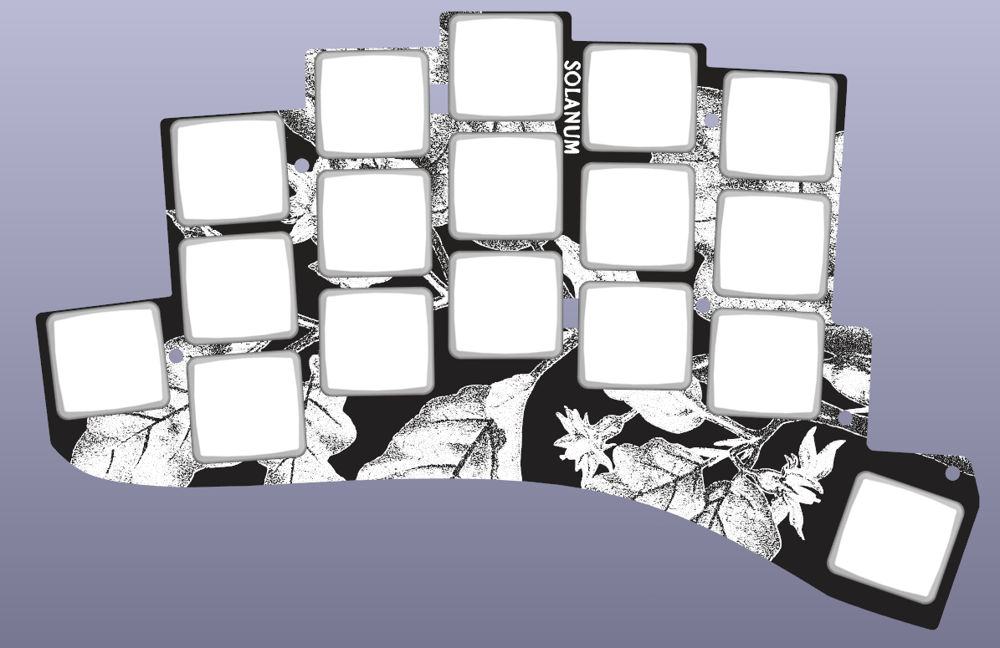

# Solanum

Solanum is a 34-key diodeless split keyboard based around Pro Micro compatible MCU modules. It features support for both wired and wireless builds and has been designed to be easily hand-assembled. The PCB is reversible and hotswap with support for Kailh Choc (v1) switches. 

The layout of Solanum differs from the typical 34-key split in that it has only one thumb key, and a reachy pinky key. Nominal key spacing is 19x18mm. All columns features a slight splay; the pinky columns are splayed more aggressively.

The top face of the switchplate (i.e., the face which is visible on the left hand side of the keyboard) features a botanical illustration of *Solanum melongena*, the eggplant.

Solanum includes support for a splitkb.com tenting puck

## License

Solanum is provided under the terms of the [GPL v3](LICENSE). The following portions are derived from other projects:

- Choc, Pro Micro, TRRS, and jumpers used on the JST footprint: [keyboard_reversible.pretty](https://github.com/50an6xy06r6n/keyboard_reversible.pretty) by 50an6xy06r6n (MIT License)
- Tenting puck: [tenting_puck](https://github.com/splitkb/tenting_puck) by splitkb.com (MIT License)
- JST, SPDT, and mounting holes: [KiCad footprint library](https://kicad.github.io/footprints/) (CC BY-SA 4.0)
